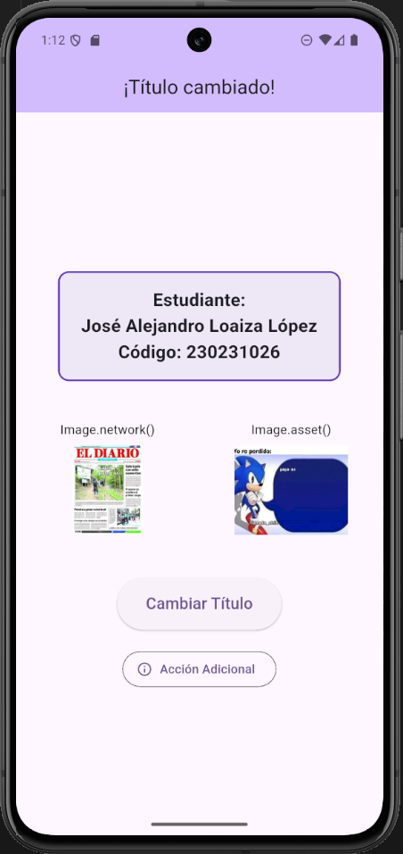
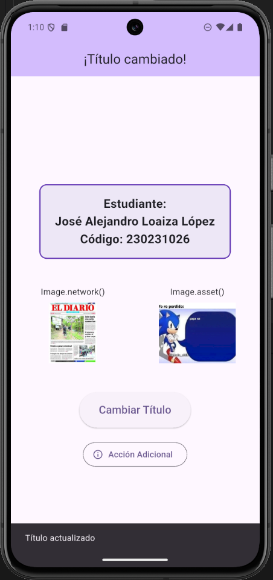
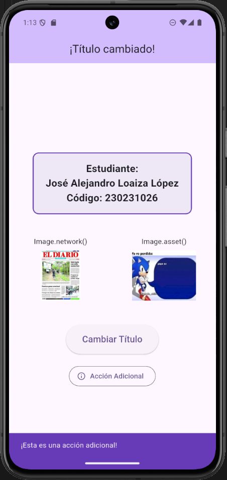

# Taller 1: Interfaz Básica en Flutter

## Descripción
Este proyecto corresponde al Taller 1. El objetivo es construir una pantalla básica en Flutter haciendo uso de `StatefulWidget` para evidenciar el uso de `setState()`. Se ha implementado un diseño que incluye un AppBar dinámico, imágenes (de red y locales), un contenedor personalizado para la información, y botones que disparan actualizaciones de estado y notificaciones (`SnackBar`).

## Datos del Estudiante
- **Nombre Completo:** José Alejandro Loaiza López
- **Código:** 230231026

## Pasos para ejecutar
1. Asegúrate de estar posicionado en la rama `feature/taller1` o en la que contenga los últimos cambios:
   ```bash
   git checkout feature/taller1
   ```
2. Abre una terminal en la raíz del proyecto y descarga las dependencias:
   ```bash
   flutter pub get
   ```
3. Ejecuta la aplicación en tu emulador o dispositivo físico:
   ```bash
   flutter run
   ```

## Capturas


- **Estado inicial de la app:**

  

- **Estado tras presionar el botón (título cambiado):**

  

- **Evidencia del SnackBar ("Título actualizado"):**

  

- **Funcionamiento del widget adicional (Acción del segundo botón):**

  
